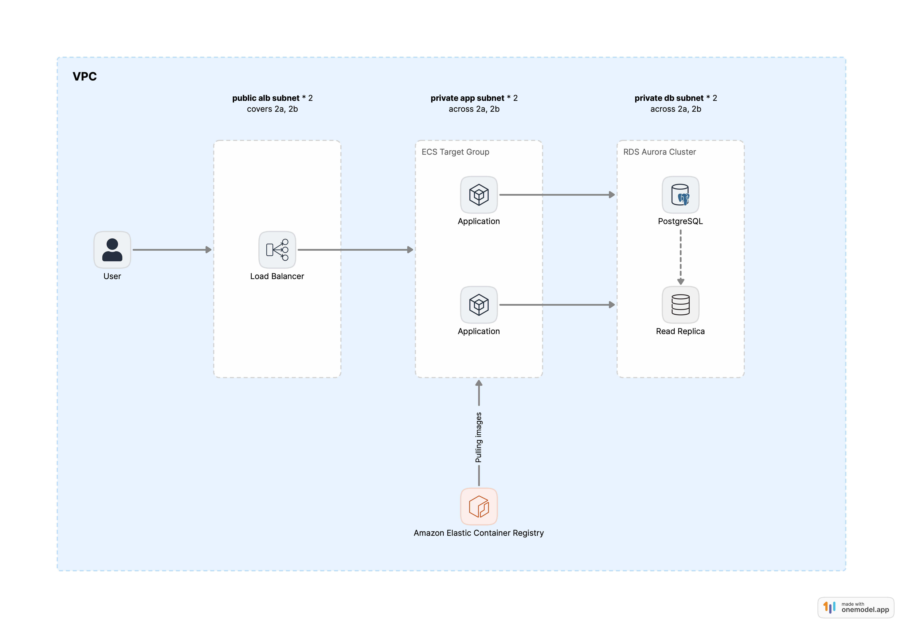

# Servian Tech Challenge - DevOps

## Tools used
- Terraform
- AWS Cli
- Git
- Docker

## Architecture Diagram

Components
- Application load balancer to receive and distribute traffic through to app servers
- App are hosted in AWS ECS Fargate across two AZs in the same region
- Database layer using RDS Aurora Postgres with read replica across AZs
- App image is hosted in ECR

##  Todos
- [x] Add application repo as a submodule 
- [x] Build a docker image for the app
- [ ] Create ECR repository using AWS Cli
- [ ] Push image to ECR

- [ ] Provisioning Infrastructure in Terraform
  - [ ] Networking
  - [ ] Security Groups
  - [ ] IAM roles
  - [ ] Database
  - [ ] Application Load Balancer
  - [ ] ECS Fargate